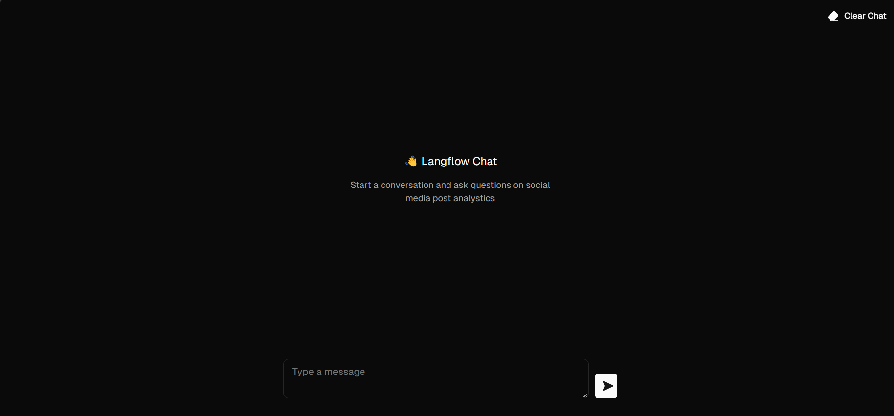

# Pre-Hackathon Assignment: Social Media Performance Analysis

### Objective

Develop a basic analytics module utilizing Langflow and DataStax to analyze engagement data from mock social media accounts.

### Live link
- Youtube demo video [https://youtu.be/UzdTjb35slk](https://youtu.be/UzdTjb35slk)
- Live demo [https://social-media-performance-analysis-chi.vercel.app/](https://social-media-performance-analysis-chi.vercel.app/)

Image

## Local set-up/test guide

1. Copy `.env.sample` to new file `.env`
2. Add your keys that are mentioned in `.env.sample` can be created at Langflow & Google gemini.
3. install deps `npm install`
4. run `npm run dev`

Open [http://localhost:3000](http://localhost:3000) with your browser to see the result/chatbot.

Team name: theboyofdream
